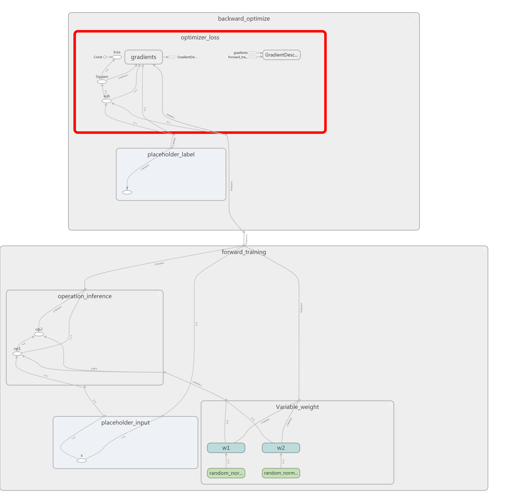

# TensorFlow笔记：搭建神经网络

## 入门

~~~python
# -*- coding:utf-8 -*-
import os
import numpy as np
import tensorflow as tf
# 0. 准备原始数据
input_x = np.random.RandomState(1234).rand(32, 2).astype(np.float32)
label_y = [[int(i + j < 1)] for i, j in input_x]
# 1. 新建数据流图
graph = tf.Graph()
with graph.as_default() as g:  # 设为默认数据流图，名称作用域和操作节点都放在这个图里面
    # 1.1 前向训练
    with tf.name_scope('forward_training'):
        with tf.name_scope('placeholder_input'):  # a 占位符，针对输入数据
            x = tf.placeholder(tf.float32, shape=(None, 2), name='x')
        with tf.name_scope('Variable_weight'):  # b 权重变量，针对权重
            w1 = tf.Variable(tf.random_normal(
                [2, 3], stddev=1, seed=1), name='w1')
            w2 = tf.Variable(tf.random_normal(
                [3, 1], stddev=1, seed=1), name='w2')
        with tf.name_scope('operation_inference'):  # c 操作节点推断
            op1 = tf.matmul(x, w1, name='op1')
            op2 = tf.matmul(op1, w2, name='op2')
        y1 = op2  # 最后一个操作节点是预测输出，命名为y1意味着跟y配对比较
    # 1.2 反馈优化
    with tf.name_scope('backward_optimize'):
        with tf.name_scope('placeholder_label'):  # 占位符，针对标签数据
            y = tf.placeholder(tf.float32, shape=(None, 1), name='y')
        with tf.name_scope('optimizer_loss'):  # 损失函数及优化函数
            loss = tf.reduce_mean(tf.square(y - y1), name='loss')  # 均方损失函数
            training_rate = 0.001  # 优化速率
            opt = tf.train.GradientDescentOptimizer(
                training_rate).minimize(loss)  # d 损失函数优化器优化权重参数
    # 2. 执行数据流图
    with tf.Session(graph=g) as sess:  # 对话
        # 3. 导出数据流图
        with tf.summary.FileWriter('graph', sess.graph) as writer:  # 图数据导出
            init_op = tf.global_variables_initializer()
            sess.run(init_op)  # 2.1 参数Variable初始化
            steps = 3000
            batch = 8
            for i in range(steps):
                start = (i * batch) % 32
                end = start + batch
                X = input_x[start:end]
                Y = label_y[start:end]
                sess.run(opt,  # 运行优化器
                         feed_dict={x: X, y: Y})
                if i % 500 == 0:
                    total_loss = sess.run(loss,  # 计算损失函数
                                          feed_dict={x: input_x, y: label_y})
os.system('explorer .')  # 打开文件夹
os.system('start C:\\Users\\dengchaohai\\AppData\\Local\\Google\\Chrome' +
          '\\Application\\chrome.exe http://localhost:6006')  # 打开tensorboard网址
os.system('tensorboard --logdir=graph')  # 运行tensorboard

~~~
