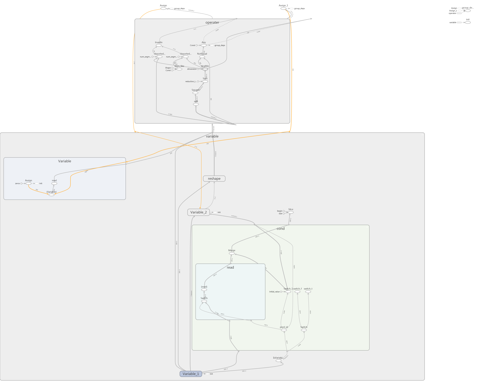

**Building Machine Learning Projects with TensorFlow**

——Rodolfo Bonnin

[TOC]

------

## Dimensionality Reduction（降维）

### *PCA（主成份）*

### *Self Coding Machine（自编码器）*

## Clustering（聚类）

### *K-means（K均值）*

~~~python
# coding:utf-8
import time
from sklearn.datasets.samples_generator import make_blobs
import matplotlib.pyplot as plt
import numpy as np
import tensorflow as tf
'''
K均值聚类算法是先随机选取K个对象作为初始的聚类中心。
然后计算每个对象与各个种子聚类中心之间的距离，
把每个对象分配给距离它最近的聚类中心。
聚类中心以及分配给它们的对象就代表一个聚类。
一旦全部对象都被分配了，
每个聚类的聚类中心会根据聚类中现有的对象被重新计算。
这个过程将不断重复直到满足某个终止条件。
终止条件可以是没有（或最小数目）对象被重新分配给不同的聚类，
没有（或最小数目）聚类中心再发生变化，误差平方和局部最小。
'''
#=========================================================================
# 使用sklearn数据生成器合成聚类数据
#=========================================================================
N = 200  # 200个点
K = 4  # 4团
centers = [(-2, -2), (-2, 1.5), (1.5, -2), (2, 1.5)]  # 4团中心点
data, features = make_blobs(n_samples=N,  # data训练数据，feature标签数据
                            centers=centers,
                            n_features=2,
                            cluster_std=0.8,
                            shuffle=False,
                            random_state=42)
fig, ax = plt.subplots()  # 既然生成数据了，画个图玩玩呗，后面的训练效果可以参考此图
ax.scatter(np.asarray(centers).transpose()[0],
           np.asarray(centers).transpose()[1],
           marker='o',
           s=250)
ax.scatter(data.transpose()[0],
           data.transpose()[1],
           marker='o',
           s=100,
           c=features,
           cmap=plt.cm.coolwarm)
plt.draw()
plt.pause(10)
plt.close(fig)
time.sleep(5)
#=========================================================================
# 有数据了，现在可以开始我们K均值聚类了
#=========================================================================
graph = tf.Graph()
with graph.as_default() as g:
    #=========================================================================
    # 构建数据流图
    #=========================================================================
    with tf.name_scope('variable'):
        cluster_assignments = tf.Variable(tf.zeros([N], dtype=tf.int64))
        points = tf.Variable(data)
        centroids = tf.Variable(
            tf.slice(points.initialized_value(), [0, 0], [K, 2]))
        with tf.name_scope('reshape'):  # 如果Variable形状发生变化需用shape处理
            rep_centroids = tf.reshape(tf.tile(centroids, [N, 1]), [N, K, 2])
            rep_points = tf.reshape(tf.tile(points, [1, K]), [N, K, 2])
    with tf.name_scope('operater'):
        sum_squares = tf.reduce_sum(tf.square(rep_points - rep_centroids),
                                    reduction_indices=2)
        best_centroids = tf.argmin(sum_squares, 1)  # 返回最小索引
        did_assignments_change = tf.reduce_any(tf.not_equal(best_centroids,
                                                            cluster_assignments))

        def bucket_mean(data, bucket_ids, num_buckets):
            total = tf.unsorted_segment_sum(data,
                                            bucket_ids,
                                            num_buckets)
            count = tf.unsorted_segment_sum(tf.ones_like(data),
                                            bucket_ids,
                                            num_buckets)
            return total / count

        means = bucket_mean(points,
                            best_centroids,
                            K)
    # tf.control_dependencies是用来控制计算流图的，给图中的某些计算指定顺序
    with tf.control_dependencies([did_assignments_change]):
        # tf.group指将几个操作放一起进行
        do_updates = tf.group(centroids.assign(means),
                              cluster_assignments.assign(best_centroids))
    #=========================================================================
    # 参数初始化
    #=========================================================================
    sess = tf.Session()
    sess.run(tf.global_variables_initializer())
    #=========================================================================
    # 开始迭代
    #=========================================================================
    MAX_ITERS = 1000
    changed = True
    iters = 0
    colourindexes = [2, 1, 4, 3]
    start = time.time()  # 计时器开始
    while changed and iters < MAX_ITERS:
        fig, ax = plt.subplots()
        iters += 1
        [changed, _] = sess.run([did_assignments_change,  # 这个控制迭代效果是否达到要求
                                 do_updates])
        [centers, assignments] = sess.run([centroids,  # 重新计算质心
                                           cluster_assignments])
        ax.scatter(sess.run(points).transpose()[0],
                   sess.run(points).transpose()[1],
                   marker='o',
                   s=200,
                   c=assignments,
                   cmap=plt.cm.coolwarm)
        ax.scatter(centers[:, 0],
                   centers[:, 1],
                   marker='^',
                   s=550,
                   c=colourindexes,
                   cmap=plt.cm.plasma)
        ax.set_title('Iteration ' + str(iters))
        plt.draw()
        plt.pause(5)
        plt.close(fig)
    end = time.time()  # 计时器结束
#=========================================================================
#
#=========================================================================
print("Found in %.2f seconds" % (end - start)), iters, "iterations"
print("Centroids:\n", centers)
print("Cluster assignments:\n", assignments)

~~~

### *k-nearest neighbors（K近邻）*

## Regression（回归）

### *Linear Regression（线性回归）*

## classification（分类）

### *Logistic Regression（逻辑回归）*

## ANN（人工神经网络）

### *FNN（前向神经网络）*

### *CNN（卷积神经网络）*

### *RNN（循环神经网络）*

### *DNN（深度神经网络）*