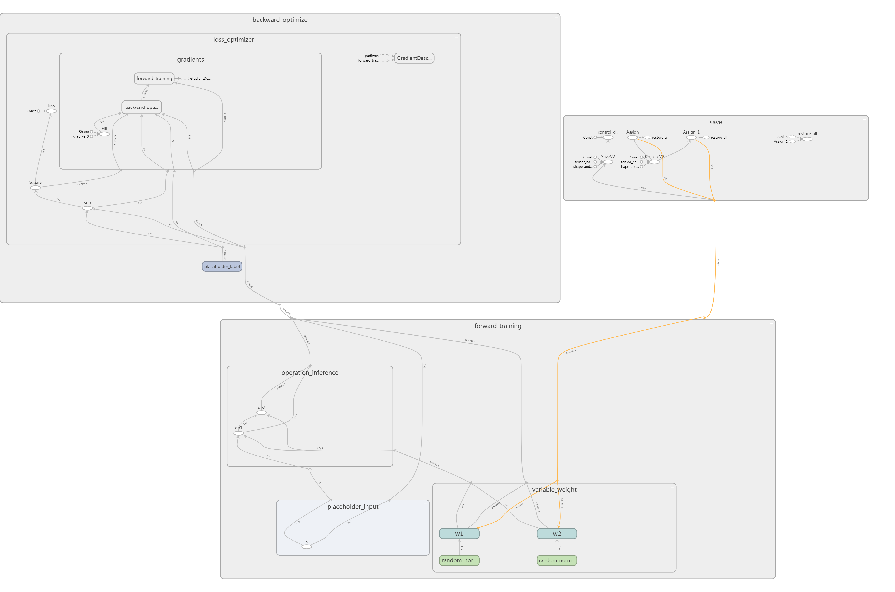

# TensorFlow学习笔记：构建神经网络（进阶）

~~~python
# -*- coding:utf-8 -*-
import os

import numpy as np
import pandas as pd
import tensorflow as tf

#=========================================================================
# 随机生成一些数据来用
#=========================================================================
raw_x = np.random.RandomState(1234).rand(32, 2)  # 32*2的矩阵或2阶张量
raw_y = [[int(i + j < 1)] for i, j in raw_x]  # 32*1的向量或1阶张量
df = pd.DataFrame(data={'x1': raw_x[:, 0].tolist(),  # 特征1
                        'x2': raw_x[:, 1].tolist(),  # 特征2
                        'y': [i[0] for i in raw_y]},  # 标签1
                  index=[i for i in range(len(raw_x))])
df.to_csv('csv_file.csv', index=False)
#=========================================================================
# 将dataframe格式或array格式的数据转为tensor格式，其他的数据分割、塑形等操作也可放在这部分
#=========================================================================

def transformRawData(csv_file='csv_file.csv'):
    df = pd.read_csv(csv_file)
    input_x = np.array([df[['x1', 'x2']].iloc[i] for i in range(len(df))])
    label_y = [[df['y'].iloc[i]] for i in range(len(df))]
    return input_x, label_y

#=========================================================================
# 主要功能：
# 1. 构建数据流图
# graph套forward_training、backward_optimize，
# forward_training套placeholder_input、variable_weight、operation_inference，
# backward_optimize套placeholder_label、loss_optimizer，
# 2. 执行数据流图
# Session、run
# 辅助功能：
# a. 导出流图的结构
# file_writer
# b. 保存训练检查点
# check_point
#=========================================================================
graph = tf.Graph()  # 创建数据流图容器
with graph.as_default() as g:  # 设为默认数据流图，名称作用域和操作节点都放在这个图里面
    with tf.name_scope('forward_training'):  # 前向训练
        with tf.name_scope('placeholder_input'):  # 占位符，针对输入数据
            x = tf.placeholder(tf.float32, shape=(None, 2),
                               name='x')
        with tf.name_scope('variable_weight'):  # 权重变量，针对权重
            w1 = tf.Variable(tf.random_normal([2, 3], stddev=1, seed=1),
                             name='w1')
            w2 = tf.Variable(tf.random_normal([3, 1], stddev=1, seed=1),
                             name='w2')
        with tf.name_scope('operation_inference'):  # 操作节点推断
            op1 = tf.matmul(x, w1,
                            name='op1')
            op2 = tf.matmul(op1, w2,
                            name='op2')
        y1 = op2  # 最后一个操作节点是预测输出，命名为y1意味着跟y配对比较
    with tf.name_scope('backward_optimize'):  # 反馈优化
        with tf.name_scope('placeholder_label'):  # 占位符，针对标签数据
            y = tf.placeholder(tf.float32, shape=(None, 1),
                               name='y')
        with tf.name_scope('loss_optimizer'):  # 损失函数及优化函数
            loss = tf.reduce_mean(tf.square(y - y1),
                                  name='loss')  # 均方损失函数
            training_rate = 0.001  # 优化速率
            opt = tf.train.GradientDescentOptimizer(
                training_rate).minimize(loss)  # 损失函数优化器优化权重参数
    train_saver = tf.train.Saver()  # 保存训练检查点对象
    with tf.Session(graph=g) as sess:  # 对话，注意graph=g
        with tf.summary.FileWriter('graph', sess.graph) as writer:  # 图数据导出
            init_op = tf.global_variables_initializer()
            sess.run(init_op)  # 权重参数初始化
            steps = 3000  # 训练次数
            batch = 8  # 一次训练需要的数据量
            check_point = tf.train.get_checkpoint_state(
                os.path.dirname(__file__))
            try:
                if check_point and check_point.model_checkpoint_path:  # 存在检查点
                    train_saver.restore(
                        sess, check_point.model_checkpoint_path)
                    initial_step = int(
                        check_point.model_checkpoint_path.rsplit('-', 1)[1])
                else:
                    initial_step = 0
            except exception as e:
                print('check point exception:\n', e)
                initial_step = 0
            input_x, label_y = transformRawData()  # 得到整个数据流
            for i in range(initial_step, steps):
                start = (i * batch) % 32  # 数据流切块
                end = start + batch
                X = input_x[start:end]
                Y = label_y[start:end]
                sess.run(opt,  # 运行优化器
                         feed_dict={x: X, y: Y})
                if i % 500 == 0:
                    total_loss = sess.run(loss,  # 计算损失函数
                                          feed_dict={x: input_x, y: label_y})
                    train_saver.save(sess, os.path.dirname(
                        __file__), global_step=i)
            train_saver.save(sess, os.path.dirname(
                __file__), global_step=steps)
#=========================================================================
# 输出到tensorboard看图
#=========================================================================
os.system('explorer .')  # 打开文件夹
os.system('start C:\\Users\\dengchaohai\\AppData\\Local\\Google\\Chrome' +
          '\\Application\\chrome.exe http://localhost:6006')  # 打开tensorboard网址
os.system('tensorboard --logdir=graph')  # 运行tensorboard

~~~

